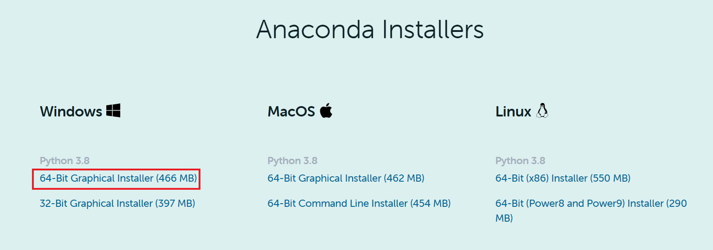
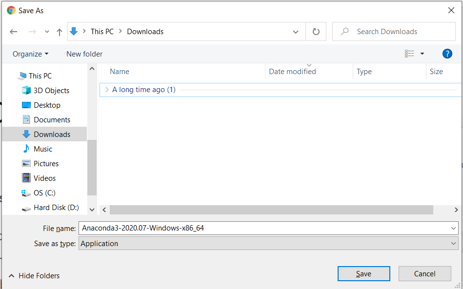
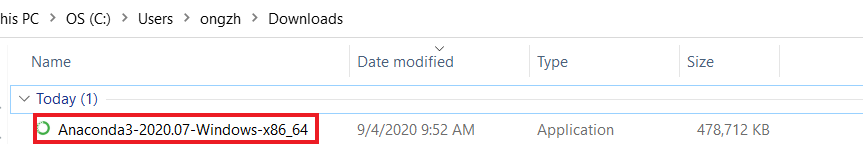
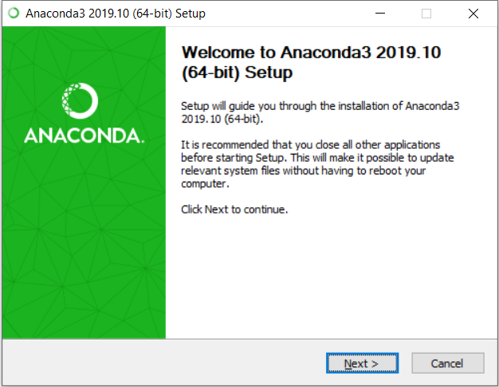
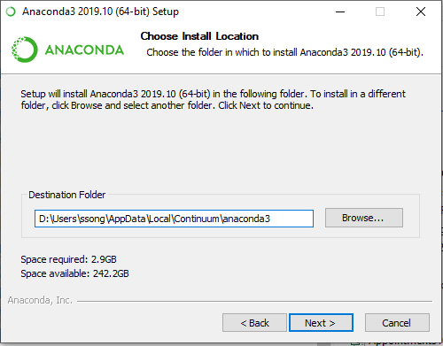
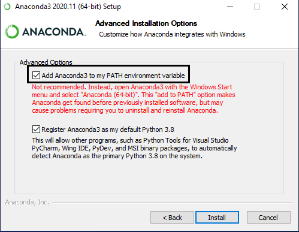
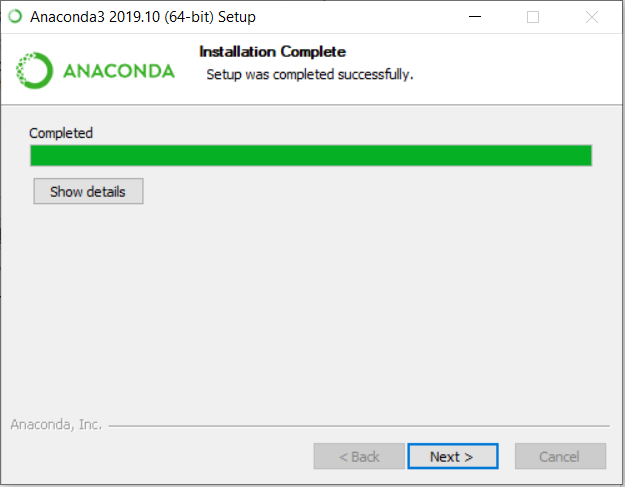
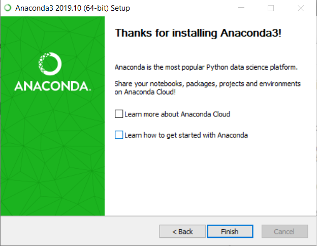
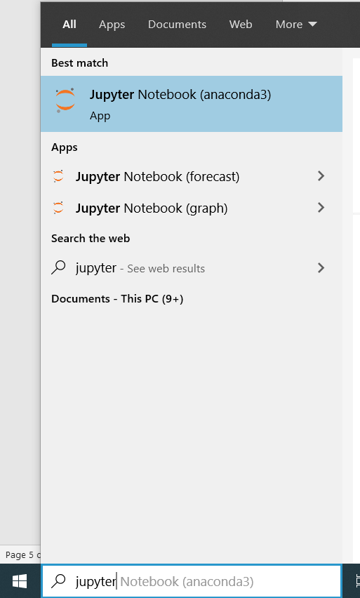
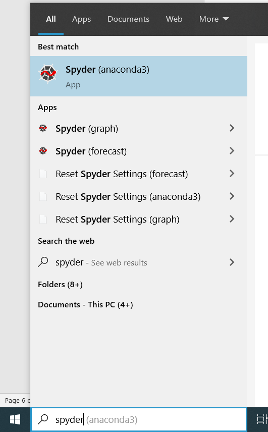

# Anaconda Installation Guide

[comment]:  (Testing out my first mkdocs)
Dear Learners,

Below you may find the steps to download and install Anaconda in your PC. 

FAQ – What is Anaconda and why are we using it?

- Anaconda is a free and open-source distribution of the Python programming language
- Anaconda come with many packages along with Python, which is essential for data analysis and data science work

## Section 1: Download Anaconda Installer
1. Follow [this link](https://www.anaconda.com/products/individual#windows). Scroll down to the section “Anaconda Installers” and click on “64-Bit   Graphical Installer” as shown in the screenshot below.

      
    
    
2. Click “Save” to start downloading the Anaconda Installer  

>

## Section 2: Install Anaconda

Once you have downloaded the installer, you can launch the installer and follow the instructions as prompted. **Please tick the top box in Step 5.**

1.	Navigate to the directory where the Anaconda Installer is downloaded. Double click on the installer as shown in the screenshot below.

    
    

2. Click Next

    
    

3. Click Next

    
  

4. Click Next

    
    

5. Click Install **(TICK THE TOP BOX)**

    
    

6. Wait for it to run, it may take 5-10minutes. Click Next when it is completed.

    
     

7. Untick both boxes and click Finish

    
    

## Section 3: Running Python Integrated Development Environment (IDE)
With Anaconda installed, two Python IDE – Jupyter Notebook and Spyder is automatically installed as well.
We strongly recommend beginners to start writing Python codes using Jupyter Notebook.

### 3.1: Launch Jupyter Notebook
To launch Jupyter Notebook, type “jupyter” in your PC’s search box and click on “Jupyter Notebook”  
    
    <!--  -->

Jupyter offers two versions of user interface, i.e. JupyterLab and Jupyter notebook.

Personally, I highly recommend using JupyterLab. Steps to launch each version are as follow:

#### 3.1.1: Running JupyterLab
Open a browser and type in the link - [http://localhost:8888/lab](http://localhost:8888/lab)

#### 3.2.2: Running Jupyter notebook (classic version)
Open a browser and type in the link - [http://localhost:8888/tree](http://localhost:8888/tree)

### 3.2: Launch Spyder
To launch Spyder, type “spyder” in your PC’s search box and click on “Spyder”
    
    <!--  -->

## Section 4: Install R Studio and Visual Studio Code using Anaconda
It is also possible to download R Studio and Visual Studio Code using Anaconda.

1. Launch **Anaconda Navigator**

2. Look for **R Studio** and **Visual Studio Code** and click **Install**

3. Afte the installation, click on **Launch** to launch the application

**Last Updated: 7 September 2020**

**Anaconda Version: Anaconda Individual Edition 2020.07**

**Python Version: 3.8**
