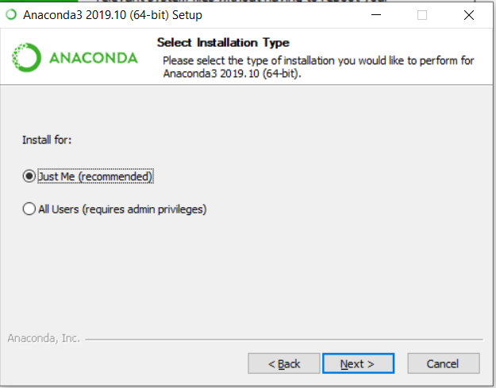

# Anaconda Installation Guide

[comment]:  (Testing out my first mkdocs)
Dear Learners,

Below you may find the steps to download and install Anaconda in your PC. 

FAQ – What is Anaconda and why are we using it?

- Anaconda is a free and open-source distribution of the Python programming language
- Anaconda come with many packages along with Python, which is essential for data analysis and data science work

## Section 1: Download Anaconda Installer
1. Follow [this link](https://www.anaconda.com/products/individual#windows). Scroll down to the section “Anaconda Installers” and click on “64-Bit   Graphical Installer” as shown in the screenshot below.

      
    
    
2. Click “Save” to start downloading the Anaconda Installer  

>

## Section 2: Install Anaconda

Once you have downloaded the installer, you can launch the installer and follow the instructions as prompted.

1.	Navigate to the directory where the Anaconda Installer is downloaded. Double click on the installer as shown in the screenshot below.

    
    

2. Click Next

    
    

3. Click Next

    
  

4. Click Next

    
    

5. Click Install

    
    

6. Wait for it to run, it may take 5-10minutes. Click Next when it is completed.

    
     

7. Untick both boxes and click Finish

    
    

## Section 3: Running Python Integrated Development Environment (IDE)
With Anaconda installed, two Python IDE – Jupyter Notebook and Spyder is automatically installed as well.
We strongly recommend beginners to start writing Python codes using Jupyter Notebook.

To launch Jupyter Notebook, type “jupyter” in your PC’s search box and click on “Jupyter Notebook”
    
    <!--  -->

To launch Spyder, type “spyder” in your PC’s search box and click on “Spyder”
    
    <!--  -->

**Last Updated: 7 September 2020**

**Anaconda Version: Anaconda Individual Edition 2020.07**

**Python Version: 3.8**
