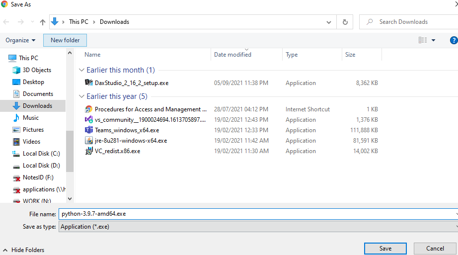

# Python Installation Guide (Check version)

[comment]: # (Testing out my first mkdocs)
Hello All,

Please follow this page and download Python and Jupyter ONLY if you are unable to install [Anaconda](/installer_guide/anaconda/)

## Section 1: Download Python Installer
1. Click on [this link](https://www.python.org/ftp/python/3.9.11/python-3.9.11-amd64.exe) to download the installer.
<!-- 1. Follow [this link](https://www.python.org/downloads/). Click on Download Python x.x.x (Download the latest version that you can see.) 
[Screenshot](img/python.png)   -->
    
    
2. Click “Save” to start downloading the Python Installer  

>

## Section 2: Install Python

Once you have downloaded the installer, you can launch the installer and follow the instructions as prompted. **Please take note on Step 2!**

1.	Navigate to the directory where the Python Installer is downloaded. Double click on the installer as shown in the screenshot below.

    
    

2. **Untick 'Install launcher for all user (recommended)' and tick 'Add Python x.x to PATH'.** Click Install Now and follow the subsequent instructions.

    
    

<!-- ## Section 3: Install and Run Jupyter

Once Python is installed, you may run the following to install and run jupyter notebook.

1. In the search bar, search for command prompt and open it.

    
    

2. Type "pip install notebook" and hit enter. (Alternatively, you may type pip install jupyterlab". jupyterlab is another flavour of jupyter notebook.)

    
    

3. Once it is completed. Type "juypter notebook" to run the notebook (or "jupyterlab" if you installed jupyterlab). A tab will automatically open in your browser. If not, type localhost:8888 into any browser.

     -->