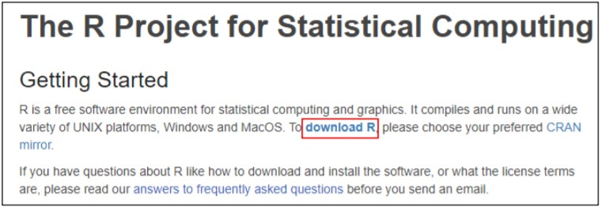
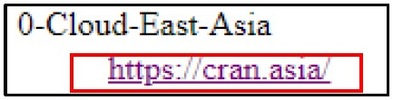
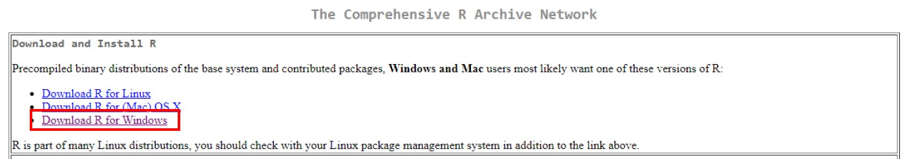
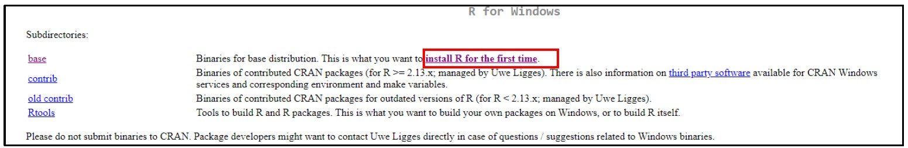
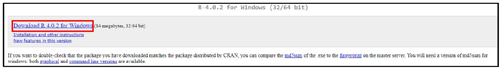
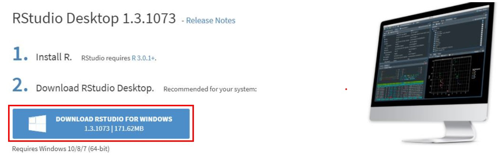
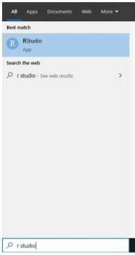

# R Installion Guide

Hello All,

Below you may find the steps to download and install R and R Studio in your PC. 

## Section 1: Download and Install R
1. Follow [this link](https://www.r-project.org/). Click the "download R" link in the middle of the page under "Getting Started."

    
    

2. Search for “0-Cloud-East Asia” and click the corresponding link

    
   

3. Click on the "Download R for Windows" link at the top of the page. 

    
    

4. Click on the "install R for the first time" link at the top of the page.

    
    

5. Click "Download R for Windows" and save the executable file somewhere on your computer. Run the .exe file and follow the installation instructions.

    
    

<!-- 6. During the installation, please change the Destination Location to the following path:

    
     -->

## Section 2: Download and Install R Studio (NOTE: Installation of R Studio requires admin access)

1. Follow [this link](https://rstudio.com/) and click on the "Download" button

    
    

2. Scroll down and click on "Download RStudio Desktop” and save the executable file. Run the .exe file and follow the installation instructions. *

    
    

## Section 3: Running R Studio
To launch R Studio, type “r studio” in your PC’s search box and click on “RStudio”
    

**Last Updated: 8 September 2020**

**R Version: 4.0.2**